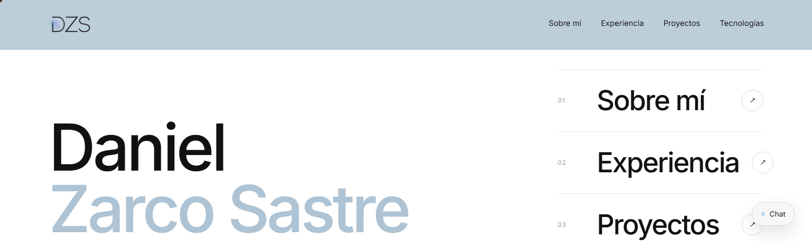

# Daniel Zarco Sastre — Portfolio

Desarrollador **Full-Stack** en Madrid, con foco en lógica de negocio, automatización y datos. Este portfolio multipágina reúne mis proyectos, experiencia, tecnologías, formación y certificaciones — e incluye un chatbot que responde sobre mi perfil.



[Ver portfolio en vivo ↗](https://portfolio-dzs.vercel.app/)

## Tecnologías


React 19 · Vite 8 · React Router 7 · CSS custom (sin frameworks UI) · ESLint 9 · Despliegue en Vercel (rewrites SPA + Analytics). Contenido centralizado en un único módulo de datos.

## Funcionalidades principales

- **Portfolio multipágina** con transiciones animadas y reveals al hacer scroll
- **Diseño responsive** con menú móvil a pantalla completa
- **Proyectos** con estado, stack y enlaces, más sección de **Certificaciones** con credenciales verificables
- **Chatbot** que responde sobre mi perfil, experiencia, proyectos, tecnologías, formación o certificaciones usando el contenido real del portfolio (sin claves en el frontend)
- Preloader, cursor personalizado y micro-interacciones en hovers

## Rutas

| Ruta | Contenido |
| --- | --- |
| `/` | Home — presentación y proyectos |
| `/sobre-mi` | Bio, perfil y áreas de enfoque |
| `/experiencia` | Trayectoria profesional |
| `/proyectos` | Proyectos + Certificaciones |
| `/tecnologias` | Stack por bloques + formación |

> 📧 Los datos de contacto (email, teléfono, GitHub, LinkedIn) están en el **footer**, presentes en todas las páginas.

## Proyectos destacados

| # | Proyecto | Estado | Stack | Enlaces |
| --- | --- | --- | --- | --- |
| 01 | **MiCarro** — gestión de la compra (cesta, favoritos, productos) | En desarrollo | Angular · Spring Boot · Java · PostgreSQL · REST · JPA | [Demo ↗](https://micarro-j0jf.onrender.com/) · [GitHub ↗](https://github.com/Daniel-Zarco/MiCarro) |
| 02 | **TodoF1** — estadísticas históricas de F1 (TFG) | En desarrollo | JavaScript · HTML · CSS · SQL | [GitHub ↗](https://github.com/Daniel-Zarco/todoF1-2025) |
| 03 | **FitCity AI** — fitness geolocalizado con validación por IA | En desarrollo | Angular · JavaScript · IA · Geolocalización | — |
| 04 | **Proyecto UNED** — base de datos de Patrimonio Cultural | Colaboración | Drupal · Bases de datos · Contenidos | [UNED ↗](https://www.uned.es/universidad/inicio/) |

## Instalación

```bash
git clone https://github.com/Daniel-Zarco/Portfolio.git && cd Portfolio
npm install
npm run dev        # desarrollo
npm run build      # producción → dist/
```

> Node 20.19+ o 22.12+ (requisito de Vite 8). Scripts extra: `npm run preview`, `npm run lint`.

## Enlaces

- [Portfolio en vivo ↗](https://portfolio-dzs.vercel.app/)
- [GitHub ↗](https://github.com/Daniel-Zarco)
- [LinkedIn ↗](https://www.linkedin.com/in/daniel-zarco-sastre-76547b350/)
- ✉️ [d.zarcosastre@gmail.com](https://mail.google.com/mail/?view=cm&fs=1&to=d.zarcosastre@gmail.com)
